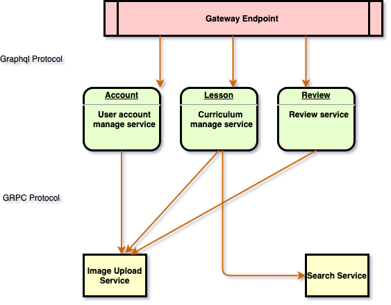

### `Architectural Design`

#### `Communications Protocol`
* GraphQL
각각의 서비스마다 Graphql서비스가 운영되고 있으며, 
앞단의 Gateway에서 여러개의 Graphql 서비스를 Schema stitching하여 제공해주고 있습니다. 
[schema-stitching](https://www.apollographql.com/docs/apollo-server/features/schema-stitching/)

* GRPC Protocol
서비스간의 통신을 위해서 GRPC를 사용합니다. 현재는 이미지업로드, 검색등을 GRPC서비스로 이용하여
서비스간에 편리하게 통신처리 하고 있습니다. 

